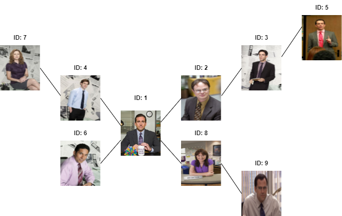

# Challenge 18 - People You May Know

In this challenge, you'll implement the "People You May Know" functionality in the `HobbyScout` application. This feature suggests potential friends to users based on a social graph, considering mutual friends and their connections.

## Core Functionalities

- Retrieve a list of people that the user may know.
- Suggestions are based on mutual friends and their connections in a social graph.
- Prioritize suggestions based on the depth of the friend graph, showing closer connections (friends of friends) before those further away.
- Exclude users who have already received friend requests or sent friend requests to the authenticated user.

# Test Cases

The provided test suite covers various scenarios to ensure the proper functionality of the "People You May Know" feature in HobbyScout. The API endpoint for this functionality is `/api/friends/{userId}/people-you-may-know`.

  

Given above is an example friends graph. Without delving into the specifics of the algorithm, the "People You May Know" for `User 1` in this example are `User 3`, `User 7`, `User 9`, and `User 5`—in that order.

# Implementation Notes

- The response format for the "People You May Know" feature includes the following user information:
    - `id`: User's unique identifier.
    - `email`: User's email address.
    - `gender`: User's gender.
    - `image_url`: URL of the user's profile image.
    - `firstname`: User's firstname.
    - `lastname`: User's lastname.
- In addition to the friendship consider the order of the user `id` as well.
- The friend suggestions can go up to an infinite depth.